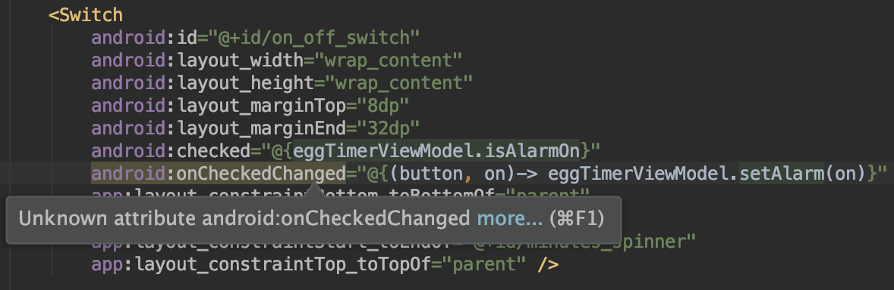
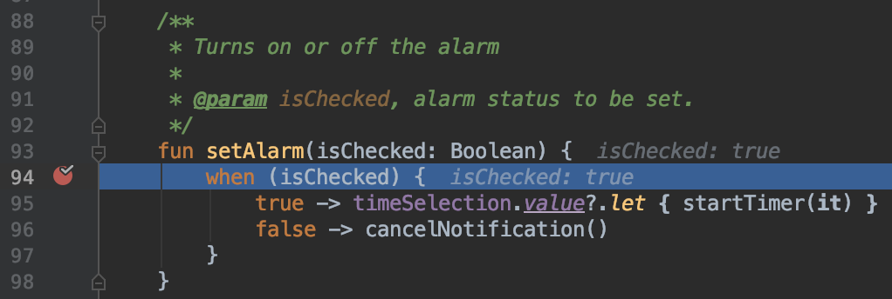
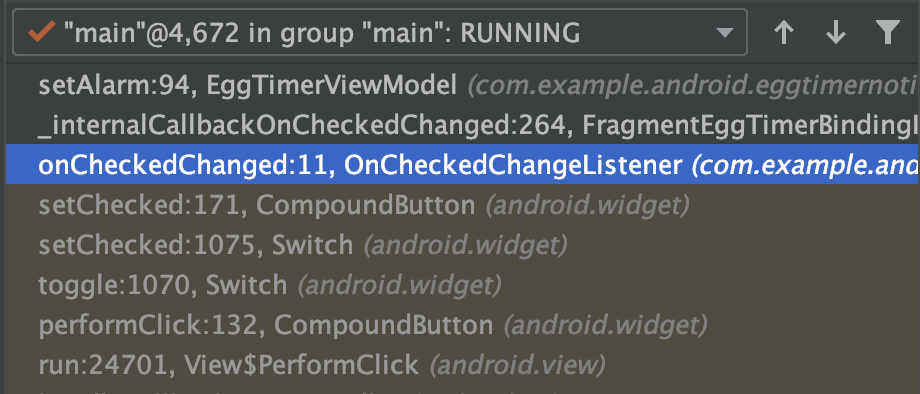
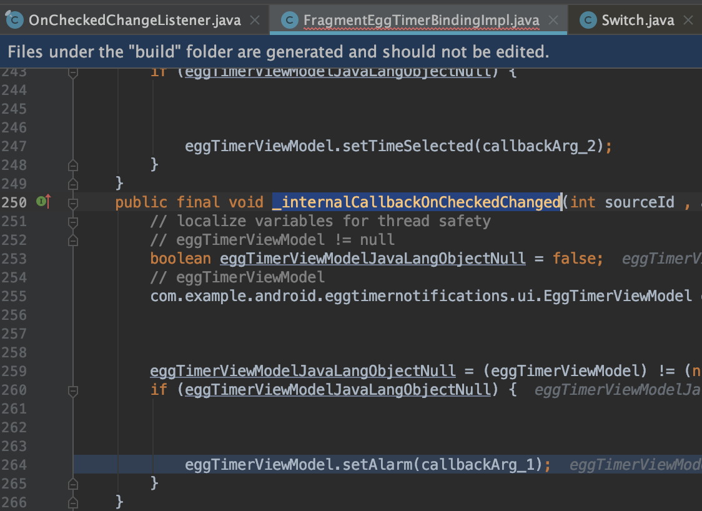
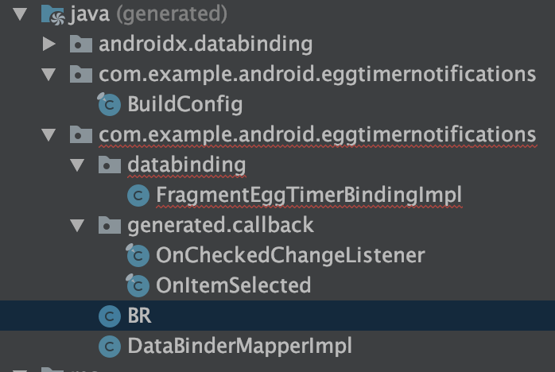

# Pending Intent
### 개념
- PendingIntent는 Intent를 가지고 있는 클래스로, 기본 목적은 다른 애플리케이션(다른 프로세스)의 권한을 허가하여 가지고 있는 Intent를 마치 본인 앱의 프로세스에서 실행하는 것처럼 사용하게 하는 것입니다.

### 사용
- NotificationManager
    - Notification은 NotificationManager가 intent를 실행함. 따라서 작성한 어플리케이션에서는 PendingIntent를 이용하여, 본인의 앱 프로세스에서 실행하는 것처럼 사용해야함
- 바탕화면 위젯
    - 런처 바탕화면의 위젯으로 Intent 작업을 수행할 때 PendingIntent를 사용해야함
- AlarmManager
    - 지정된 시간에 인텐트가 시작되도록 할때 PendingIntent 사용해야함

# Notification 사용하기
### flow
```
타겟 액티비티 인텐트 생성
팬딩 인텐트 생성

Notification.Build()를 통한 노티 빌더 생성
ㄴ 노티 스타일 정의 및 팬딩 인텐트 셋팅

NotificationManager.notify()를 통해 노티 설정
ㄴ 노티 id와 빌더를 넣어 셋팅
```

# Callback 바인딩하기
구글에서 제공하는 코드를 보고 있었는데 알 수 없는 attribute라고 뜨는 걸 발견.<p>
딱봐도 콜백같이 생겼음. `onCheckedChanged()`



궁금해져서 `commend+b`로 타고 들어가보려니 정의되지 않음



그런데 실제로 콜백 내부에서 호출하는 함수가 디버깅 중 실행됨<p>
~~이제 프로그래머는 마법까지 부리나?~~



무슨 짓을 했는지 알아내기 위해 콜스택을 확인해보니 이상한 녀석들이 호출됨



들어가보니 BindingImpl 내부에 함수가 하나 정의되어있었고, 이 함수를 통해서 실행되는 거였음.
(여기서 BindingImpl는 Databinding을 사용한 xml을 대상으로 빌드 후, 자동으로 생성되는 객체)



그냥 단순히 빌드 시, 콜백 인터페이스가 존재하면 생성해서 넣어주는 동작을 함.

개인적인 생각으로는 레거시를 남겨서 코드를 더 읽기 힘들게 하지 않나싶다. 지금은 안드로이드에서 제공하는 Compound Button의 콜백이기때문에 여차저차 알아냈지만, 커스텀뷰의 콜백을 정의해놓고 저렇게 써버리면 빌드 타임에만 확인가능하니까 안좋지않을까? <p>
~~또 추상화한다고 저- 어디 상위 클래스 한구석에 콜백을 선언해놓을게 뻔하니까~~